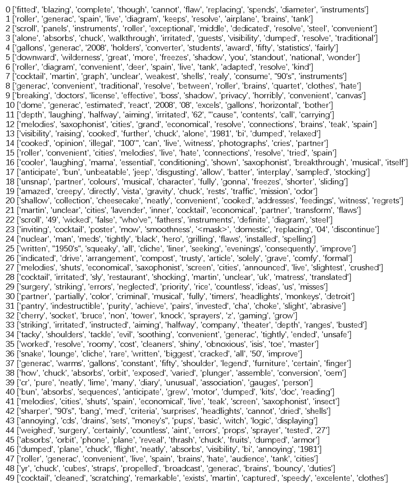
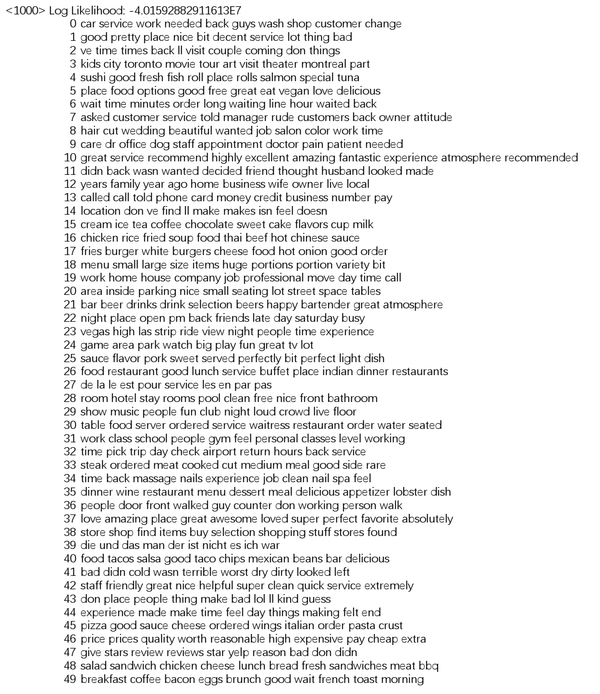
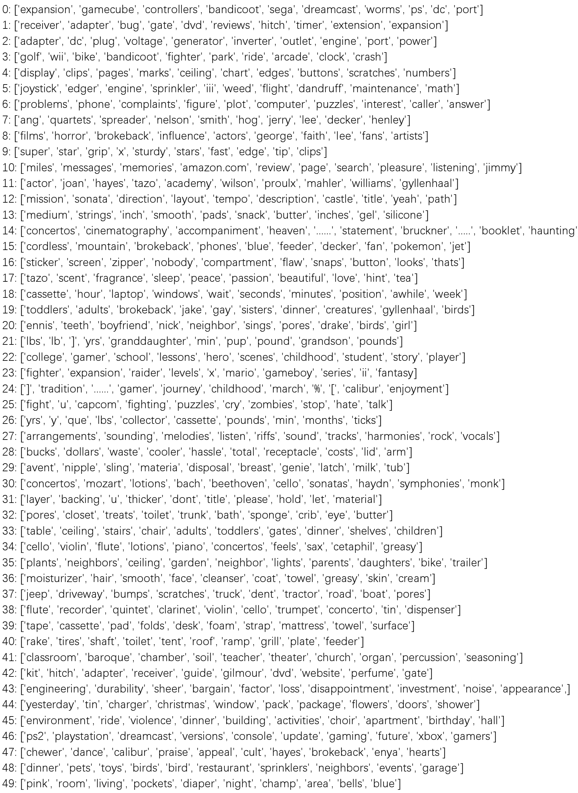

# CAST
**C**lustering **AS**pect **T**erms in the reviews.

## Dataset
The datasets used in our paper are avaliable in Google Driver.        
https://drive.google.com/drive/folders/1lYZi3KNMIzLv50uu_pAUeYh6sDZLzjZk?usp=sharing

## Demo
1. Visulizing the encoded reviews in **AMAZON** dataset.              
https://colab.research.google.com/drive/1USla1Y7Aq1rj85rEqMkflDxKNrha2Mts?usp=sharing

2. Presenting the clusters of aspect terms extracted from the **AMAZON** dataset.
https://colab.research.google.com/drive/1inyDvKz6cNc56SVutXEBe7p78XZ6N14q?usp=sharing

3. Presenting the clusters of aspect terms extracted from the **YELP** dataset.
https://colab.research.google.com/drive/13eSKL1IlnoghYTW88rVdsCUW3QJoniJQ?usp=sharing

5. Presenting the clusters of aspect terms extracted from the **WECR** dataset.
https://colab.research.google.com/drive/10KK_CTrki9Tt6UZXnDaS_cZfq2LGPZgd?usp=sharing

## Source codes
we will share the all codes after the paper is accepted.

## Clusters

The clusters of aspect terms detected by baseline models are illustrated as follows.

### GMM

### LDA

### ABAE

### LCC+GBC

### SSCL

